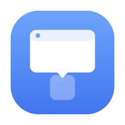
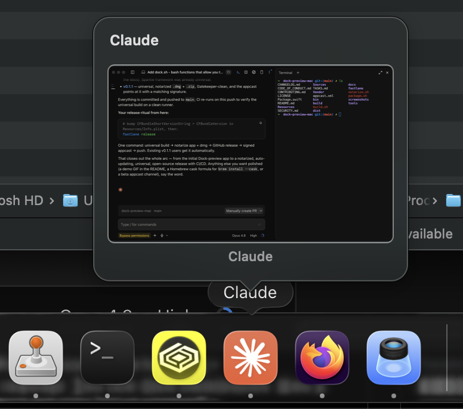
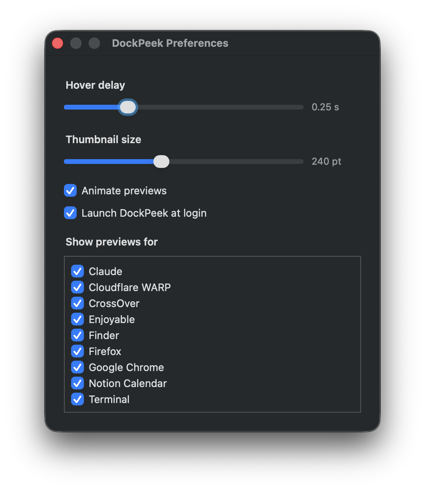
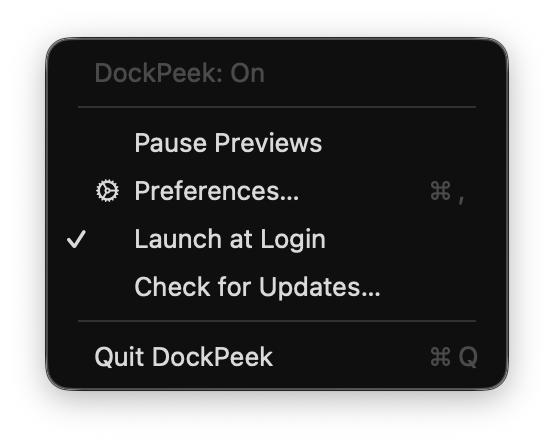

<p align="center">
  
</p>

<h1 align="center">DockPeek — <code>dock-preview.app</code></h1>

[](https://github.com/PrajjwalDatir/dock-preview-mac/actions/workflows/ci.yml)
[](https://github.com/PrajjwalDatir/dock-preview-mac/releases/latest)
[](LICENSE)
[](#requirements)

Hover any running app in the macOS Dock and get a live preview of its windows —
the way the Windows taskbar does it. Runs as a quiet menu-bar app; no Dock
injection, no disabling SIP, no system-wide hacks.

<p align="center">
  
</p>

## Install

1. Download the latest `.dmg` from the [**Releases**](https://github.com/PrajjwalDatir/dock-preview-mac/releases/latest) page.
2. Open it and drag **dock-preview** to Applications.
3. Launch it — the app is signed and **notarized by Apple**, so it opens with no
   Gatekeeper warning.
4. Grant **Accessibility** and **Screen Recording** in the onboarding window, then
   click **Relaunch**.

Prefer to build it yourself? See [Build & run](#build--run).

## How it works

| Piece | API |
|-------|-----|
| Detect which Dock icon the cursor is over | Accessibility (`AXUIElementCopyElementAtPosition`, `AXDockItem`) |
| Resolve the icon to a running app | Dock item `AXURL` → bundle id → `NSRunningApplication` |
| Capture window thumbnails | ScreenCaptureKit (`SCScreenshotManager.captureImage`) |
| Show the preview | Borderless non-activating `NSPanel` above the icon |

It never injects into `com.apple.dock`. It only *observes* via the Accessibility
API and *reads* window images via ScreenCaptureKit — both gated behind one-time,
per-app macOS permissions.

## Permissions (granted once)

1. **Accessibility** — to read which Dock icon the cursor is over and its frame.
2. **Screen Recording** — to capture the window images shown in the preview.

Nothing is recorded, saved, or sent anywhere; images live only in memory to draw
the thumbnail. A friendly onboarding window walks you through both, with a
**Relaunch** button because Screen Recording only re-evaluates on launch.

## Build & run

```bash
./build.sh            # compiles + assembles dock-preview.app + ad-hoc signs it
open ./dock-preview.app
```

Then grant the two permissions in the onboarding window. `dock-preview.app` lands
in the project root and launches on double-click.

Regenerate the icon after editing `tools/make_icon.swift`:

```bash
swift tools/make_icon.swift && ./build.sh
```

## Package for distribution

```bash
./package.sh          # → dist/dock-preview-<version>.zip and .dmg (ad-hoc signed)
```

To let *other* Macs open it without Gatekeeper warnings, sign + notarize with a
Developer ID (needs an Apple Developer account):

```bash
export DEVELOPER_ID="Developer ID Application: Your Name (TEAMID)"
./notarize.sh
```

## Preferences (menu bar → Preferences…)

- **Hover delay** — how long to rest on an icon before the preview appears.
- **Thumbnail size** — preview card width.
- **Animate previews** — fade/scale-in (auto-disabled under Reduce Motion).
- **Launch at login** — register as a login item (`SMAppService`).
- **Per-app list** — turn previews off for specific apps.

<p align="center">
  
</p>

## Interaction

- **Hover** a Dock app → preview pops out of the icon (bottom, left, or right Dock).
- **Click** a thumbnail → that window is raised and its app activated.
- **Esc** → dismiss.
- Menu bar → **Pause / Resume**, **Preferences…**, **Launch at Login**, **Check for Updates…**, **Quit**.

<p align="center">
  
</p>

## Accessibility

VoiceOver labels on every preview card, Esc-to-dismiss, and automatic honoring of
**Reduce Motion** and **Reduce Transparency**.

## Layout

```
Sources/DockPeek/
  main.swift            App entry (accessory app)
  AppDelegate.swift     Wiring, menu bar, permission lifecycle
  PermissionManager.swift
  DockObserver.swift    Event-driven hover detection (Accessibility)
  WindowService.swift   ScreenCaptureKit capture + cache
  PreviewController.swift  Floating panel, positioning, animation, click-to-raise
  OnboardingWindow.swift
  SettingsWindow.swift
  LaunchAtLogin.swift
  Settings.swift
Resources/Info.plist, AppIcon.icns
tools/make_icon.swift   Icon generator
build.sh / package.sh / notarize.sh
TASKS.md                Full task DAG + status
```

## Requirements

macOS 14+, Apple Silicon or Intel. Built with SwiftPM (no Xcode project needed).

## Contributing

Issues and PRs are welcome — see [CONTRIBUTING.md](CONTRIBUTING.md) and the
[Code of Conduct](CODE_OF_CONDUCT.md). For security reports, see [SECURITY.md](SECURITY.md).

## License

DockPeek is free software licensed under the **GNU Affero General Public License
v3.0 or later** (AGPL-3.0-or-later) — see [LICENSE](LICENSE). In short: you're free to
use, study, share, and modify it, but if you distribute it or run a modified version
as a network service, you must make your source available under the same terms.

Copyright © 2026 Prajjwal Datir and contributors.
