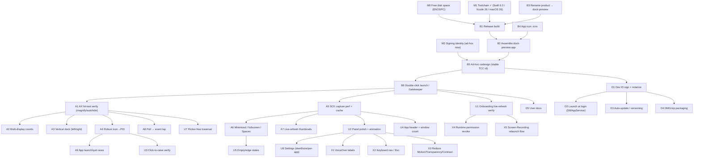

# dock-preview.app — Task DAG

**Goal:** a `dock-preview.app` a user double-clicks in the project root and it runs —
showing live window previews when hovering Dock icons (Windows-taskbar style).

## Status (updated)

**Implemented:** M0, M1, M2, B1–B6, A1(logic), A2, A3, A4, A5, A7(snapshot chosen),
A8, A9, U1–U7, X1, X2(Esc), X3, X4, X5, D2, D4, D5, and the D1 pipeline (script).

`dock-preview.app` builds via `./build.sh`, is ad-hoc signed + icon'd, launches on
double-click, and `./package.sh` emits `dist/*.zip` + `*.dmg`.

**Genuinely still pending / needs a human:**
- ~~Re-grant after each rebuild~~ **RESOLVED** — now signed with the machine's
  Developer ID (`Prajjwal Datir, 2HA88J9PL3`); `build.sh` uses it automatically, so
  the Designated Requirement is stable and TCC grants persist across rebuilds.
- **D1 notarization** — signing done; notary submission still needs a stored
  `notarytool` credential profile (`notarize.sh` ready to run).
- **A2/A3/A6 real-world testing** — multi-monitor, left/right Dock, and
  minimized/fullscreen/Spaces behavior are coded but only verifiable by hand on
  varied setups. Minimized windows are currently skipped (SCK on-screen only).
- **X2 full keyboard nav** — Esc-to-dismiss done; arrow-key traversal is not, because
  a non-activating panel can't take key focus without stealing it from your app.

Legend: everything in "Implemented" above is done; the tables below are the original
plan for reference.

## Critical path to the goal (minimum to double-click and run)
`M0 → B3 → B1 → B4 → B2 → B5 → B6`, then smoke-test `A1` + `A5`.
Everything else hardens it but isn't required for a first double-clickable build.

## Task detail

### Layer 0 — Machine (blocking)
| ID | Task | Notes | Depends |
|----|------|-------|---------|
| M0 | Free disk space | `ENOSPC` blocked release build and shell output. Cleared ~/DerivedData & SwiftPM caches. Keep an eye on it (volume ~97% full). | — |
| M1 | Toolchain | Swift 6.3, Xcode 26, macOS 26 — done. | — |
| M2 | Signing identity | Ad-hoc `-` runs locally; Developer ID needed to share. | — |

### Layer 1 — Build & package
| ID | Task | Notes | Depends |
|----|------|-------|---------|
| B3 | Rename product → `dock-preview` | Goal names `dock-preview.app`; internal target is `DockPeek`. Update `Package.swift`, `build.sh`, `Info.plist`. | — |
| B1 | Release build | `swift build -c release`. | M0, M1, B3 |
| B4 | App icon | `.icns` in `Contents/Resources`, `CFBundleIconFile`. Shows in permission lists. | — |
| B2 | Assemble `.app` | `build.sh` copies binary + Info.plist into bundle. | B1, B4 |
| B5 | Codesign | Ad-hoc so TCC remembers a stable identity across runs. | B2, M2 |
| B6 | Double-click launch | Strip quarantine (`xattr -dr com.apple.quarantine`) or document right-click→Open. | B5 |

### Layer 2 — Architecture / correctness (needs runnable build)
| ID | Task | Notes | Depends |
|----|------|-------|---------|
| A1 | Verify AX hit-testing | `AXUIElementCopyElementAtPosition` → `AXDockItem` under magnification, autohide, Stage Manager. | B6 |
| A2 | Multi-display coords | `primaryHeight` assumes one origin display; test 2 monitors / negative origins. | A1 |
| A3 | Vertical dock | Position logic assumes bottom Dock; place panel beside icon for left/right Dock. | A1 |
| A4 | Robust icon→PID | Replace title-string match with owning-app pid from the AX element. | A1 |
| A5 | Capture perf + cache | Measure SCK latency; cache last frame; cap concurrency. | B6 |
| A6 | Minimized/fullscreen/Spaces | Define behavior for minimized/fullscreen/other-Space windows. | A5 |
| A7 | Live-refresh | Optional re-capture every N ms for a live feel. | A5 |
| A8 | Poll → event tap | 20 Hz timer + AX call/tick is wasteful; move to mouse-move event tap. | A1 |
| A9 | Launch/quit races | App quits/relaunches while panel open. | A4 |

### Layer 3 — UX
| ID | Task | Notes | Depends |
|----|------|-------|---------|
| U1 | Onboarding live-refresh | Rows poll every 1 s — verify they flip to ✓ live. | B6 |
| U2 | Panel polish | Fade/scale-in, notch pointing at icon, consistent sizing. | A5 |
| U3 | Click-to-raise | AX raise-by-title implemented — verify; add per-window actions later. | A4 |
| U4 | Header + count | App name + window count above cards. | A5 |
| U5 | Empty/edge states | Running app, no capturable windows → hide vs. show. | A6 |
| U6 | Settings | Dwell time, thumbnail size, per-app toggle, launch-at-login. | U2 |
| U7 | Flicker-free traversal | Swap contents across adjacent icons without hide/show flash. | A1 |

### Layer 4 — Accessibility & permission runtime
| ID | Task | Notes | Depends |
|----|------|-------|---------|
| X1 | VoiceOver | Label cards + onboarding; panel navigable/announced. | U2 |
| X2 | Keyboard | Esc dismiss; arrows between cards; Return to raise. | U2 |
| X3 | Reduce Motion/Transparency/Contrast | Skip animation, solid bg, stronger borders. | U2 |
| X4 | Runtime revoke | If permission revoked while running, pause + re-prompt. | U1 |
| X5 | Screen-Recording relaunch | SCR grant needs a relaunch; detect + offer "Relaunch now". | U1 |

### Layer 5 — Distribution
| ID | Task | Notes | Depends |
|----|------|-------|---------|
| D5 | User docs | Install, grant permissions, quit. | B6 |
| D1 | Dev ID + notarize | Needed for other Macs to open cleanly. | B5 |
| D2 | Launch at login | `SMAppService.mainApp.register()`. | D1 |
| D3 | Auto-update | Sparkle or manual; version bumps. | D1 |
| D4 | DMG/zip | Package for download. | D1 |

## Open product decisions (shape A/U, not blockers)
- Snapshot vs. live thumbnails (A7).
- Poll vs. event tap (A8).
- Per-window actions in preview (close/quit/new-window) — v1 scope?
- Keep `DockPeek` internally but ship bundle as `dock-preview.app`?
